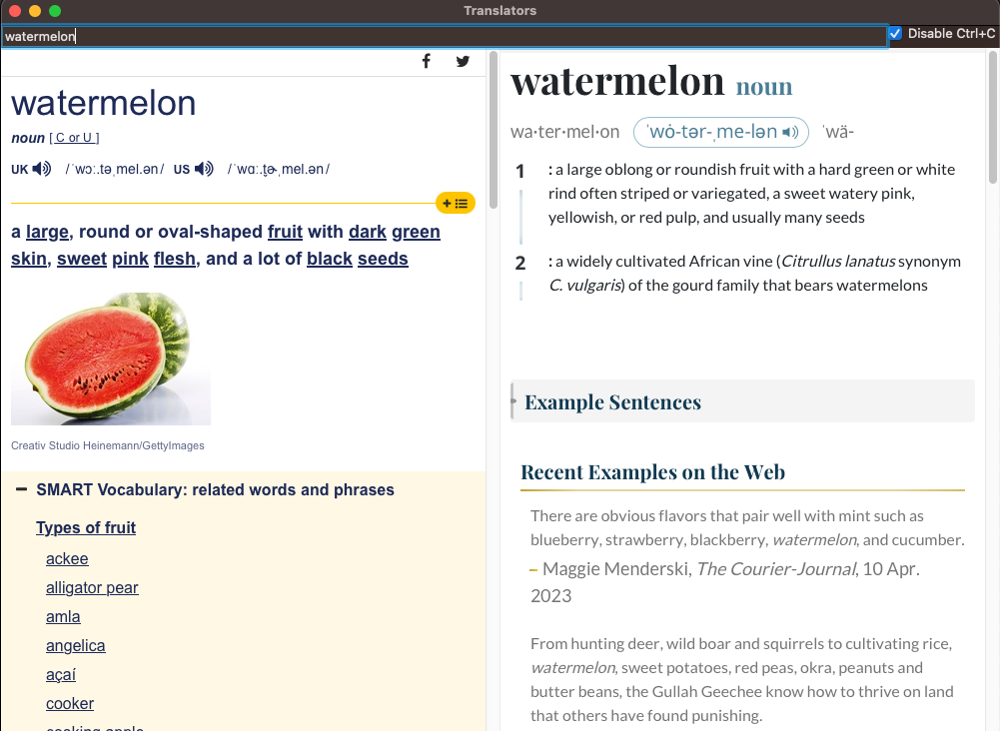
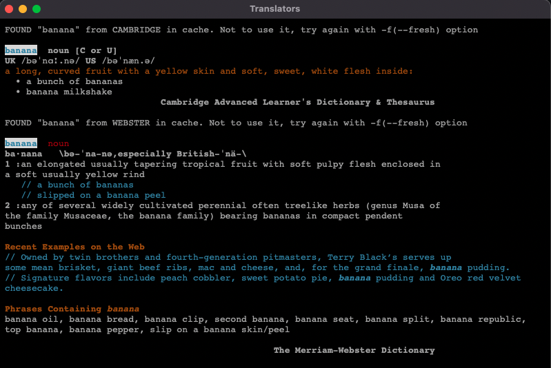

# Translators
- Translate text in clipboard every 2 seconds.
- Inspired by <https://github.com/mhwgoo/cambridge>
- Build macOS app:
```shell
python3 setup.py py2app
```
## v0.0.3

## v0.0.2

## v0.0.1

